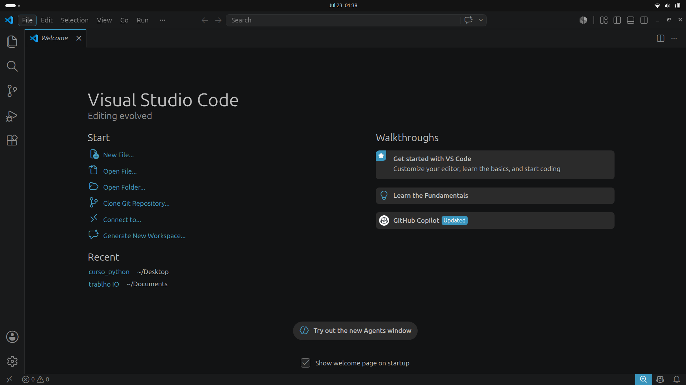
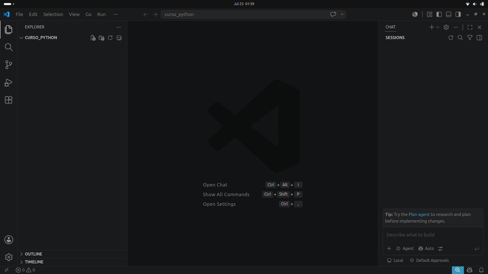
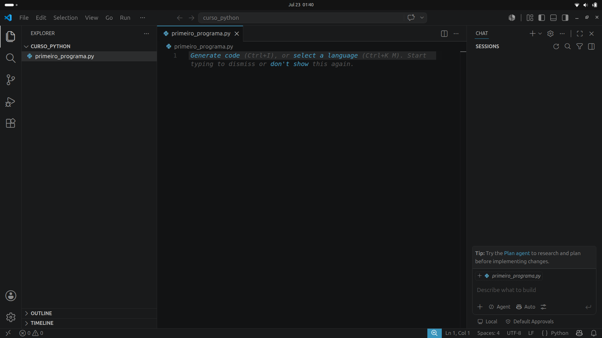
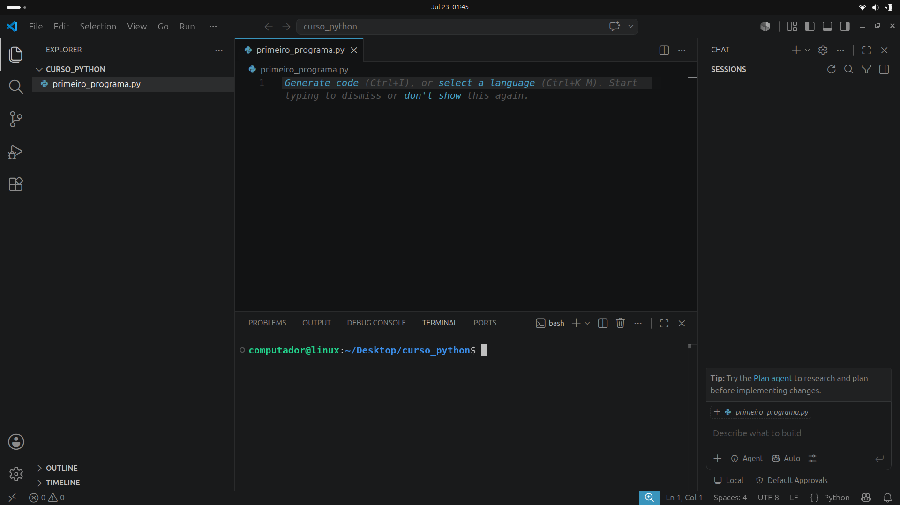
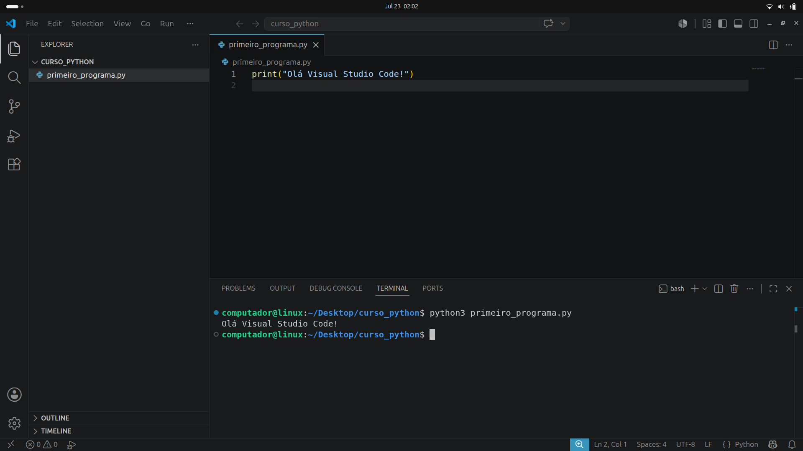

# Ambiente de Desenvolvimento

> "quote" - alguém

Até agora nossos programas tiveram apenas uma linha de código. Por incrível que pareça, aqueles comandos no terminal são por si sós pequenos programas em Python. Na verdade, um programa nada mais é do que uma coleção de comandos em sequência. 

O problema é que agora, gostaríamos de fazer algo maior e com mais linhas de código, e o terminal é limitado para isso. Como já mencionei, os programas são escritos em arquivos de texto plano, como aqueles que são produzidos no bloco de notas, e portanto, poderiam ser produzidos por qualquer programa de edição de texto. No entanto, a melhor forma de editar arquivos de texto para programas é usar um _software_ específico para isso. 

Estes _softwares_ são chamados de **IDEs** (**I***ntegrated* **D***evelopment* **E***nvironment*, ou **Ambientes de Desenvolvimento Integrados**). Elas foram criadas justamente para se poder programar, e reúnem muito mais do que a simples capacidade de escrever palavras num arquivo e salvá-lo. Com as IDEs, nós podemos organizar, executar, depurar (procurar e corrigir erros) e muito mais. Se o programador fosse um cozinheiro, a IDE seria a sua cozinha! (E as boas práticas seriam o _mise en place_).

Em nosso curso, usaremos o **Visual Studio Code**, uma das IDEs gratuitas mais populares atualmente. O **VS Code** não é feito especificamente para Python, mas para praticamente qualquer linguagem de programação (Inclusive, estou usando ele nesse exato momento, para escrever esta aula :P).

Para instalar o **VS Code**, entre no site https://code.visualstudio.com/. O site já deve reconhecer o seu sistema e oferecer o download do instalador correto. Veja: [Guia de Instalação do VS Code](#apendice:guia_de_instalacao_do_vs_code).

## Configurando nosso Ambiente

Após ter instalado a IDE, e passar pelos passos de configuração inicial, você deve estar vendo algo assim:



Crie em algum lugar do seu computador uma pasta para colocar nossos programas. Agora no VS Code, no canto superior esquerdo clique em **Arquivo** (_File_) e depois em **Abrir Pasta** (_Open Folder_). Selecione a pasta que você acabou de criar. Aqui eu criei uma pasta chamada "curso_python", na minha área de trabalho. Viu que surgiu "curso_python" na coluna lateral esquerda? 



Agora clique nessa coluna lateral esquerda onde está escrito "curso_python" e depois clique no ícone de arquivo com um sinal de mais. Dê o nome de **"primeiro_programa.py"** e aperte **Enter**. 



Por último, pressione <kbd>ctrl</kbd> + <kbd>J</kbd>, e veja um terminal surgir na parte inferior da tela. Você deve estar vendo algo como isto:



O que temos aqui: Essa coluna lateral esquerda é onde fica o explorer dos seus arquivos, ali você navega pelas pastas e arquivos do seu projeto. A parte central superior é o seu editor, onde você escreve o código. E a parte inferior é o terminal, que é o exato mesmo terminal do seu sistema. 

> Existe também uma aba lateral direita, que é o chat do Copilot, a IA do GitHub. Apesar de ser muito útil na vida profissional, esta ferramenta não é necessária para acompanhar o curso. Para fechá-la, clique no "X" que aparece no topo da aba ou <kbd>ctrl</kbd> + <kbd>alt</kbd> + <kbd>J</kbd>. É bom também [desabilitar o auto-completar](https://code.visualstudio.com/docs/editing/ai-powered-suggestions#_enable-or-disable-inline-suggestions).

# Primeiro Programa

Vamos testar executar um comando nesse ambiente que nós acabamos de criar. Digite o comando abaixo na área central da tela (o editor):

```python
print("Olá Visual Studio Code!")
```

Salve o arquivo <kbd>ctrl</kbd> + <kbd>S</kbd> e, em seguida, no terminal digite:

```bash
$ python3 primeiro_programa.py
```

Vimos um texto aparecer no terminal, correto? Então, acabamos de escrever e executar o nosso primeiro programa!



Para melhorar ainda mais a nossa experiência, instale a [extensão Python](https://marketplace.visualstudio.com/items?itemName=ms-python.python) para o VS Code. Ela oferece alguns recursos extras que facilitam o desenvolvimento em Python. Para isso clique no ícone de extensões ()  na coluna lateral esquerda e pesquise por "Python". Então clique no botão **Instalar**. Agora, volte para o seu arquivo, clicando na aba do editor, e no canto superior direito, clique no botão de play  para executar o programa. Você deve ver o mesmo resultado no terminal.

Agora que já temos tudo pronto, podemos começar a estudar Python de verdade!

## Apêndice: Guia de Instalação do VS Code

Para acompanhar o curso e escrever seus programas com facilidade, siga o passo a passo abaixo para instalar o **VS Code** no seu sistema operacional.

### Windows

1. **Baixar o Instalador**:
   - Acesse o site oficial do [VS Code](https://code.visualstudio.com/).
   - Clique no botão **"Download for Windows"** para baixar o instalador (`.exe`).

2. **Executar o Instalador**:
   - Dê um duplo clique no arquivo baixado para iniciar o assistente de instalação.
   - Aceite os termos de licença e clique em **Avançar**.

3. **Configurações Recomendadas**:
   - Na tela de tarefas adicionais, é recomendável marcar as opções:
     - **Adicionar "Abrir com Code"** ao menu de contexto de arquivos e diretórios.
     - **Adicionar ao PATH** (permite abrir o VS Code pelo prompt de comando usando `code`).

4. **Concluir**:
   - Clique em **Instalar** e, ao finalizar, em **Concluir** para abrir a IDE.

---

### Linux

Existem formas simples de instalar no Linux, dependendo da sua distribuição:

#### Ubuntu / Debian e derivados

- **Via Snap Store (Recomendado/Mais simples)**:
  Abra o terminal (<kbd>Ctrl</kbd> + <kbd>Alt</kbd> + <kbd>T</kbd>) e digite:
  ```bash
  $ sudo snap install code --classic
  ```

- **Via pacote `.deb` (Site Oficial)**:
  1. Acesse [code.visualstudio.com](https://code.visualstudio.com/) e baixe o pacote `.deb`.
  2. No terminal, navegue até a pasta de downloads e execute:
     ```bash
     $ sudo dpkg -i code_*.deb
     $ sudo apt-get install -f
     ```

#### Fedora / Red Hat / SUSE

- **Via pacote `.rpm`**:
  1. Baixe o pacote `.rpm` no site oficial.
  2. No terminal, execute:
     ```bash
     $ sudo dnf install ./code-*.rpm
     ```

---

> :bulb: **Dica:** Após a instalação, você pode abrir o VS Code em qualquer sistema operacional navegando até a pasta do seu projeto no terminal e digitando:
> ```bash
> $ code .
> ```
> O ponto (`.`) indica ao sistema para abrir a pasta atual no VS Code!
