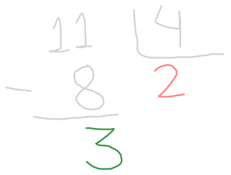

<!-- 
Esse artigo é para discutir a criação de expressões

Inicialmente pensei em faze-lo junto com if/else, mas talvez seja muita coisa pra um só artigo.

-->

> " " - algem

Chegamos agora em um assunto onde as coisas começam a ficar bem interessantes. Vamos introduzir os conceitos de **expressões**. Na verdade, você já criou várias expressões em outras aulas, como por exemplo: `1 + 2`. A soma `1 + 2` é uma expressão simples que usa o **operador** `+`. Na verdade, qualquer operação matemática é um tipo de expressão que usa um **operador aritimético** para combinar dois valores. 

Nesta aula, veremos todos os principais tipos de **operadores** do Python.

## Operações Matemáticas

A expressões matemáticas em Python são feitas com operadores aritiméticos e acredito que seu funcionamento é bem intuitivo, por motivos que irei explicar. Os operadores são exatamente os mesmos que vemos na matemática básica. Porém, melhor do que falar, é fazer!

Vamos abrir o Python pelo nosso terminal e testar algumas operações (_Veja a aula [Olá Mundo!](hello_world.md) para saber como acessá-lo). A começar pela nossa conhecida (e querida) soma, feita com o simbolo `+`:

```python
>>> 2 + 3
5
```

Agora a subtração, com o símbolo `-`:

```python
>>> 5 - 2
3
```

Então a multiplicação, feita com `*`:

```python
>>> 2 * 3
6
```

e também a divisão, feita com `/`:

```python
>>> 10 / 4
2.5
```

Diferente das outras operações, divisão `/` de dois _inteiros_ resulta em um **float**. Podemos verificar isso com a função `type()`:

```python
>>> type(2 + 3) # tipo do resultado da soma
<class 'int'>
>>> type(10 / 4) # tipo do resultado da divisão
<class 'float'>
```

Existe também a divisão inteira, representada pelo operador `//`:

```python
>>> 11 // 4
2
```

O `//` retorna o _quociente_ da divisão entre dois inteiros, ou se você preferir, o resultado dessa divisão arredondado pra baixo. 

Da mesma forma, o operador `%` retorna o **resto** da divisão entre dois inteiros. 

```python
>>> 11 % 4
3
```

Uma maneira fácil de visualizar os operadores `//` e `%` é pensar na divisão como nós aprendemos na escolinha. Por exemplo, para fazer a divisão de `11` por `4`, como costumavos fazer? Primeiros multiplicamos o `4` por algum número inteiro até o valor seja próximo, mas menor que `11`. Nesse caso, multiplicamos `4` por `2` para obter `8`. Esse `2` é o quociente, ou seja, o resultado da divisão inteira - o operador `//` em Python. O resto é o dividendo `11` menos o produto do quociente pelo divisor, ou seja, `11 - 8 = 3`. O operador `%` em Python retorna exatamente esse resto. Veja no (lindo) esquema abaixo: 



> O `%` é frequentemente chamado de operador **módulo**.

Por último o operador de exponenciação, feito com `**`:

```python
>>> 2**3
8
```

A instrução `2**3` é o mesmo que $2^3$ (_2 elevado à 3_ na matemática). 

Essa são todas as operações matemáticas suportadas pelo Python! Você deve estar sentindo falta das raizes, mas na verdade elas são feitas com o `**`. Do mesmo modo como podemos escrever, na matemática, a radicalização:

$$
\sqrt{4} = 4^{1/2}
$$

Podemos fazer em Python:

```python
>>> 4**0.5
2.0
```

## Concatenação e Repetição de textos

Vimos apenas operações matemáticas com números. Mas o Python também suporta operações com **strings**! Por exemplo, o operador `+` é usado para **concatenar** strings, ou seja, para juntá-las.

```python
>>> "Amo" + " " + "Bolo de Cenoura"
'Amo Bolo de Cenoura'
```

O operador `*` é usado para repetir strings.

```python
>>> "Não" * 5
'NãoNãoNãoNãoNão'
```

Repare que a _concatenação_ só pode ocorrer entre strings, e que a repetição só pode ocorrer entre uma string e um inteiro! Caso contrário, resulta em um erro.

```python
>>> "Bananas" + 2
Traceback (most recent call last):
  File "<stdin>", line 1, in <module>
TypeError: can only concatenate str (not "int") to str
```
```python
>>> "Laranjas" * 3.5
Traceback (most recent call last):
  File "<stdin>", line 1, in <module>
TypeError: can't multiply sequence by non-int of type 'float'
```

> Por que você gostaria de somar 2 mais bananas? Calcular 3.5 vezes laranjas?! Não sei, mas infelizmente o Python ainda não está preparado para isso...


## Expressões compostas

As expressões que nós vimos nos exemplos dos operadores aritiméticos, foram expressões _simples_, isto é, temos algo na forma `valor <operador> valor`. Mas e se quisermos fazer algo como: 

$$
2 + 3 \times 4
$$

Sabemos da matemática, que para resolver essa equação precisamos fazer primeiro a multiplicação, depois a soma. Mas se quisessemos que a soma fosse feita primeira, usariamos paranteses, assim:

$$
(2 + 3) \times 4
$$

E dessa forma a soma acontece primeiro, depois a multiplicação. **A forma como o Python resolve é exatamente a mesma!**. Em Python, a multiplicação e divisão é feita sempre antes da soma e da subtração, por exemplo:

```python
>>> 2 + 3 * 4 - 1
13
```

Aqui é feito primeiro a multiplicação `3 * 4` que dá `12`. Depois é feito a soma `2 + 12` que dá `14`. Por fim, é feito a subtração `14 - 1` que dá `13`. 

Mas e se quisermos que a soma seja feita primeiro? Assim como na matemática, usamos parênteses:

```python
>>> (2 + 3) * 4 - 1
19
```

Aqui, o Python primeiro resolve a expressão dentro dos parênteses `(2 + 3)` que dá `5`. Depois é feito a multiplicação `5 * 4` que dá `20`. Por fim, é feito a subtração `20 - 1` que dá `19`.

Da mesa forma que a matemática também, o python resolve as operações com `()` aninhados de dentro para fora. Por exemplo:

```python
>>> (2 * (3 + 1)) / 2
4.0
```

>A ordem em que as expressões são resolvidas em python segue uma hierarquia, você pode conferir em [Operator precedence](https://docs.python.org/3/reference/expressions.html#operator-precedence), na documentação do Python.

## Operadores de Comparação

Aqui, novamente, vamos ver algumas figuras conhecidas da matemática. Os operadores de **comparação**. Já vimos o `==`, que representa a igualdade. 

```python
>>> 7 == 3 + 4 
True
```

Maior que $>$, representado por `>`, e menor que $<$, representado por `<`, são usados da seguinte forma:

```python
>>> 4 > 3 # 4 é maior que 3?
True
>>> 3 > 4
False
>>> 3 < 4
True
>>> 4 < 3
False
```

Da mesma forma, maior ou igual que, $\ge$, representada por `>=` e menor ou igual que, $\le$, representada por `<=`, são usados da seguinte forma:

```python
>>> 4 >= 4 # 4 é maior ou igual a 4?
True
>>> 4 >= 5 
False
>>> 3 <= 3 # 3 é menor ou igual a 3?
True
>>> 4 <= 3 
False
```

## Operadores Lógicos

Chegamos neles, os operadores **lógicos**, o coração da computação <3. Eles são usados para combinar expressões booleanas e retornar um valor booleano. Os principais operadores lógicos são `and` (E), `or` (OU) e `not` (NÃO). 

O operador `and` (E) retorna `True` apenas se ambas as expressões forem verdadeiras. Veja:

```python
>>> True and True
True
>>> True and False
False
```

Por exemplo, vamos verificar essa expressão: 

```python
>>> 10 > 5 and 2 > 3
False
```

Do lado direito, temos `10 > 5` que é verdade e `2 > 3` que é falso. O que o operador `and` faz é perguntar, neste caso, "10 é maior que 5 **e** 2 é maior que 3?" Como a segunda parte é falsa, o resultado final é falso.

Já o operador `or` (OU), precisa que apenas uma das partes seja verdadeira para retornar `True`. Vejamos:

```python
>>> True or False
True
>>> False or False
False
```

Agora, vamos verificar a expressão abaixo:

```python
>>> 10 > 5 or 2 > 3
True
```

A pergunta que o `or`faz é "10 é maior que 5 **ou** 2 é maior que 3?". No caso, a primeira parte é verdadeira, logo, o resultado é verdadeiro. O resultado só será falso, se ambas afirmações forem falsas. 

O ultimo operador é o `not` (NÃO). Ele é usado para inverter o valor de uma expressão booleana. Vejamos:

```python
>>> not True
False
>>> not False
True
```

Agora, vamos verificar a expressão abaixo:

```python
>>> not 10 > 5
False
```

