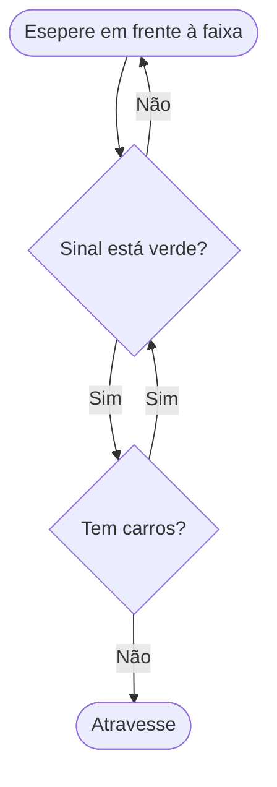
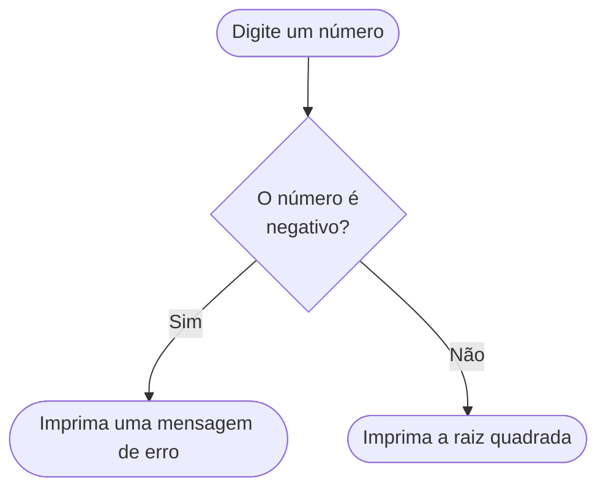
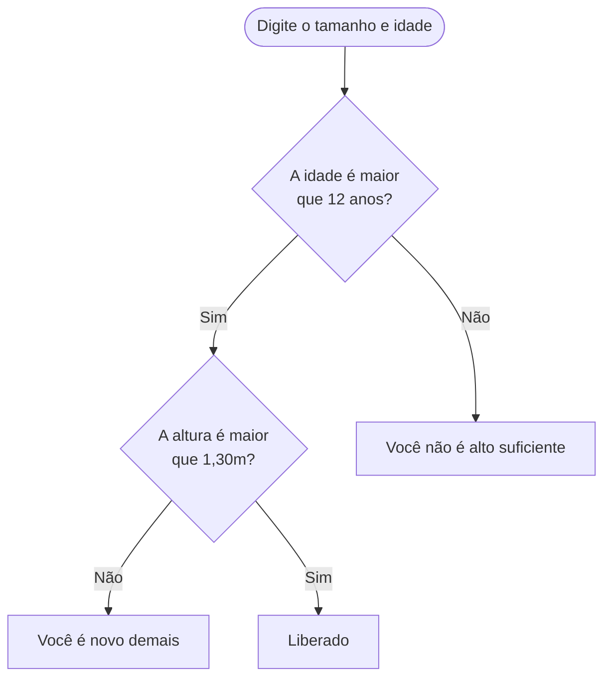
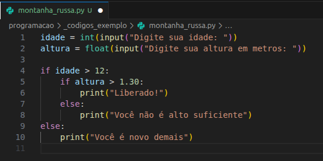
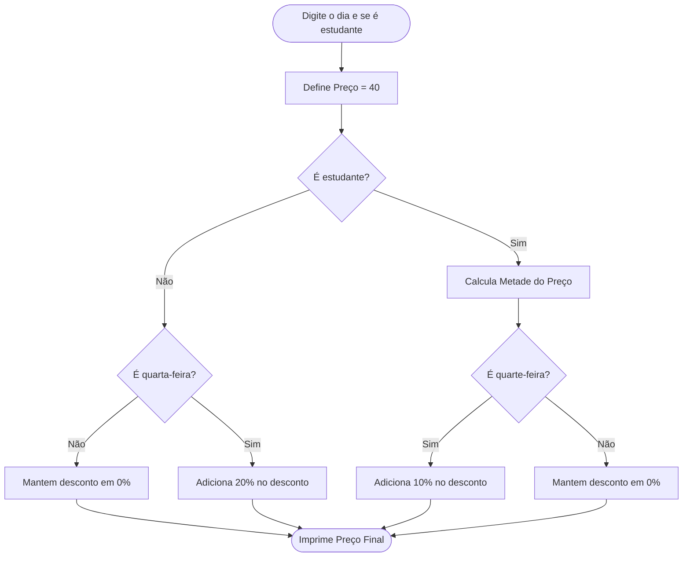
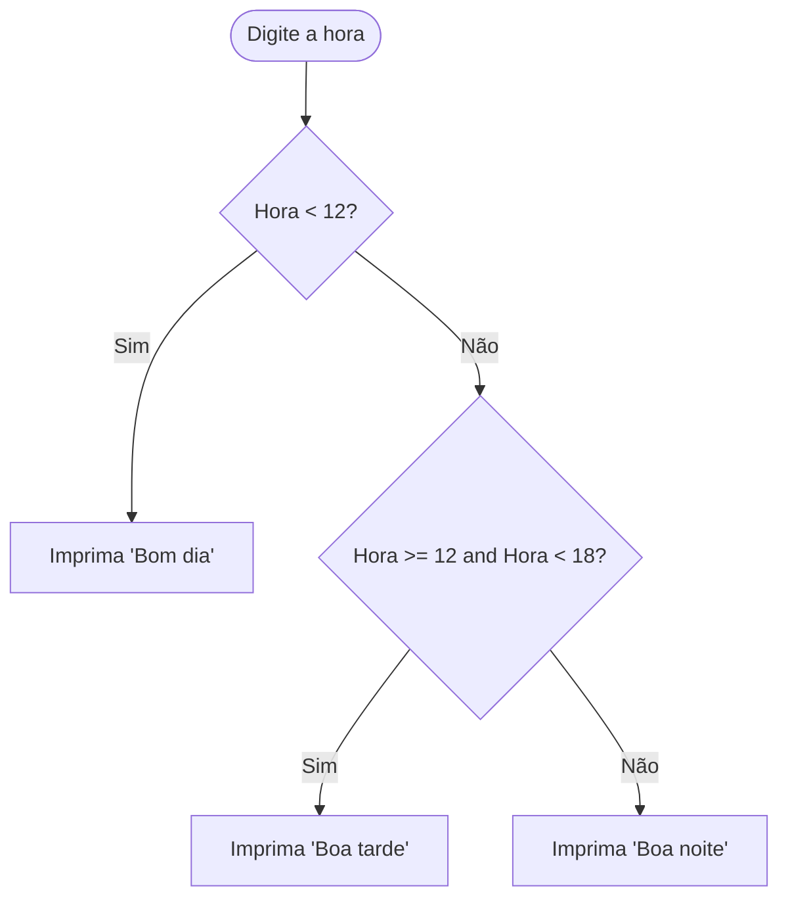

> "Contrariwise, if it was so, it might be; and if it were so, it would be; but as it isn't, it ain't. _That's logic._" - Tweedle Dee.

As estruturas de tomada de decisão são o que diferenciam o nosso computador de uma super-calculadora. São elas que dão a máquina uma inteligência aparente, digamos, artificial. Veremos nesse capítulo os _statements_ `if` e `else`! (Já estava ansioso por esse momento :D)

Porém, antes de começarmos, creio que podemos discutir um pouco sobre como estruturar um programa com condições. Na verdade esta é a parte mais importante do assunto, e onde muitos iniciantes em programação começam a ter algumas dificualdades. Em livros e aulas sobre programação a tendência comum é dar ênfase para a parte da escrita do código, mas a habilidade de _resolver problemas_ é grande alidada! E assim como outras skills, só se desenvolve com prática. 

Como quando vamos escrever um texto, não basta conhecer as palavras, mas é preciso também saber organizar as suas ideias. Ou quando vamos resolver uma questão de física, antes de fazer as contas, nós precisamos interpretar o problema e quebra-lo em pedaços menores. Tudo isso vale para a programação! 

# Rotinas e Lógica
Como você percebeu ao fazer os exercícios da última aula, fazer um programa é um exercício de pensar no problema antes de escrever qualquer código. O computador não entende o nosso pensamento, ele executa uma sequência de comandos que nós determinamos. Por isso, sempre que nos depararmos com um problema, precisamos pensar no passo-a-passo do que precisamos fazer para resolvê-lo. 

Essa sequencia de passos é uma **Rotina**. Vamos pensar na rotina de alguém que sai de casa para trabalhar ou ir para escola:

1. Tomar café da manhã
2. Tomar banho
3. **SE** estiver frio, vestir um casaco
4. Trancar a porta
5. Sair

Note que nessa rotina existe uma **decisão** a ser tomada. **Se** estiver frio, vestimos um casaco. Em outras palavras, a **condição** para vestir um casaco, é que esteja frio. Mas e se não estiver frio? Do modo que nós definimos esta rotina, nada sera feito, o próximo passo será dado. E quão frio é frio para usar casaco? Depende de cada um. Poderiamos ser mais específicos e dizer "Se estiver abaixo de 15 graus Celsius, vestir um casaco". 

> Eu levaria uma toalha ao sair de casa - Autor

Um exercício mental interessante para pensar uma rotina: Vamos pensar que você vai deixar uma receita de _algo_ para um robô burro. Por exemplo, vamos ensinar o rôbo a atravessar a rua. 

### Como atravessar a rua:

1. Espere em frente à faixa
2. Veja se o sinal de pedestre está verde
3. Olhe para os dois lado e veja se há carro
4. Atravesse

Veja como o nosso robo se saiu:


Ele executou o primeiro passo corretamente. Também executou o segunto passo corretamente. E então executou o terceiro e quarto passo. Ele foi atropelado seguindo todos os passos, pois não havia instruções claras do que seria feito com o resultado de cada passo. Antes de tomar a decisão de atravessar é preciso verificar o as condições dos outros passos são satisfeitas. 

Vamos repensar essa rotina, mas dessa vez de forma mais estruturada. 

### Como atravessar a rua v2.0:

1. Espere em frente à faixa
2. Veja se o sinal de pedestre está verde
    - Se sim, vá para o próximo
    - Se não, volte para o passo 1
3. Olhe para os dois lado e veja se há carro
    - Se sim, volte para o passo 2
    - Se não, vá para o próximo
4. Atravesse

Podemos representar essa rotina de uma forma mais visual:



>[info] Isso é um _fluxograma_, uma forma comum de apresentar _algoritimos_. Comumente representamos uma tomada de decisão com um losango. 

Para melhorar nossa rotina, podemos combinar as duas decisões em uma única. Isso porque o resultado das duas decisões é o mesmo no fim das contas, atrevessar a rua. 


Combinamos duas condições com o operador lógico **E**, e ao mesmo tempo, invertemos o resultado da segunda condição. Para poder atrvessar ao invés de verficar se "há carros" verificamos se **não** há carros. Acho que você já deve estar vendo como isso se relaciona com os operadores lógicos que vimos anteriormente.

Note que existe uma certe estrutura de repetição entre os passos 1 e 2. Sempre que a decisão tomada for negativa, o robo voltaria para o passo 1. De fato, podemos dizer que "**Enquanto** o sinal não estiver verde e não houver carros, o robô deve esperar em frente à faixa".


### Um algoritimo apra Maior Divisor Comum:

Vamos fazer mais uma rotina um pouco mais completa. Cálculo do Maior Divisor Comum entre dois inteiros, algo que aprendemos no jardim de infância. Talvez quando era criança você não entendia o porque isso funciona, mas ao seguir essa receita corretamente, você chegava no resultado (Você era um pequeno computador :3). 

O maior divisor comum é o maior número que divide dois inteiros, de forma que não haja resto. Por exemplo, o maior divisor comum entre 12 e 9 é 3. Agora olhe para o fluxograma que fizemos, e pense como você criaria uma rotina que encontra o MDC. 

Por exemplo, o MDC entre 51 e 18. Como podemos calcular isso? 

Podemos começar testando a partir do número 1, vamos chamar nosso divisor de N. Dividimos 51 por 1, e 18 por 1. Resto 0 para ambos. Então N = 1 é um divisor comum. Vamos guarda-lo na caixa `MDC`. 

Agora vamos tentar um número maior, 2. Dividimos 51 e 18 por 2. O resto de 51 divido por 2, é 1. O `MDC` continua sendo 1.

Agora vamos tentar um número maior, 3. Dividimos 51 e 18 por 3. O resto de 51 dividido por 3 é 0. E o resto de 18 dividido por 3 é 0. Logo 3 é um divisor comum. 3 é maior que 1, então vamos guardar 3 na caixa `MDC`. 

Para saber o resultado vamos repetir esse processo até que chegar em 18. Ai teremos certeza que encontramos o MDC (Nesse caso, o resultado seria 3). Ok, vamos tentar representar isso visualmente:


Preste atenção nesse fluxograma, conseguiu entender? Tome o tempo que precisar, não estamos com pressa :). Tente substituir os números por outros menores e mais simples para verificar como esse algoritmo funciona. Em breve, faremos ele no Python. 

A ideia aqui não é que você entenda completamente como construir um algoritimo completo para qualquer processo. Quero que você consinga visualizar como podemos quebrar um problema em etapas menores que se relacionam de forma lógica e sequencial. Esse tipo de abstração vai fazer bastante diferença no futuro, quando seus problemas se tornarem menos palpáveis. Bem, chega de teoria, vamos práticar. 

## Tomada de Decisão 

A primeira estrutura que vamos estudar será a **tomada de decisão** . Em Python, essa estrutura é feita com a palavra reservada `if`, que significa "SE" em inglês. Vamos ver um exemplo:

```python
idade = 20

if idade >= 18:
    print("Você é maior de idade")
```

Essa é a construção básica de um `if`. Lemos essa estrutura como _"**Se** a variável `idade` for maior ou igual à 18, vamos imprimir na tela que você é maior de idade"_. 

### Entendendo a estrutura: 

Na linha 3, temos a palavra reservada `if`, seguida de uma expressão condicional `idade >= 18`, seguida de dois pontos `:`. Aqui definimos a condição que precisa ser verdadeira para que algo seja feito.

Nas linhas após a linha 3, escrevemos os comandos que vão ser feito **se** a condição for verdade. Nesse caso há apenas um, `print("Você é maior de idade")`. 

Note que essa linha está **indentada**, ou seja, ela está deslocada para a direita. Fazemos isso pressionando <kbd>Tab</kbd>. O Python vai entender tudo que estiver _indentado_ como pertencente ao `if`.

> Costumamos dizer que as linhas indentadas estão _dentro_ do `if`.

## Senão
Se você mudar o valor de `idade` para 15? A condição não será satisfeita, e nada irá acontecer. Teste!

Para contornar isso, podemos adicionar um **`else`**, que significa "senão" em inglês. Por exemplo:

```python {.line-numbers}
idade = 15

if idade >= 18:
    print("Você é maior de idade")
else:
    print("Você é menor de idade!")
```

Agora temos uma estrutura de **se** e **senão**, `if`/`else`. Podemos ler essa estrutura como _"**Se** `idade` for maior ou igual à 18, imprima na tela que você é maior de idade, **senão**, imprima na tela que você é menor de idade"_.

### Entendendo o exemplo: 
O Python percorre a linha 3, verifica a condição do `if`, neste caso `idade >= 18`. Mas como 15 não é maior ou igual a 18, a expressão é falsa. Aí o Python ignora tudo que está indentado após o `if`, e executa as linhas indentadas após o `else`.

> Eu estou falando aqui "O Python faz isso.., faz aquilo...", como se fosse alguém lendo o código. Na verdade quem faz isso é o _compilador_. O compilador é um programa que vai executando o código linha a linha em tempo real, quando rodamos o nosso programa. Isso é o que define Python como uma **Linguagem Interpretada**

Vamos criar alguns programas exemplos, para aplicar nosso novo conhecimento.

### Exemplo 1:

Vamos fazer um programa que calcula a raiz quadrada de um número, mas se esse número for negativo, o programa deve imprimir uma mensagem dizendo que não é possível calcular a raiz quadrada de um número negativo. 

Um esquema para esse algoritimo seria:



O usuário irá digitar o número, então usaremos `input()`. Como o `input()` retorna uma `str` precisamos converter para um _inteiro_ usando `int()`. Depois deve haver uma condição que verifica _se_ o número é positivo. _Se_ for devemos calcular a sua raiz quadrada e imprimi-lá, _senão_ devemos imprimir uma mensagem. 

O código ficaria assim:

```python {.line-numbers}
numero = int(input("Digite um número: "))

if numero >= 0:
    raiz = numero ** 0.5
    print(f"A raiz quadrada de {numero} é {raiz}")
else:
    print("Não existe raiz quadrada para número negativo")
```

### Exemplo 2: 

Para brincar na montanha russa do parque, você precisa ter pelo menos 1,30m de altura, e ter mais que 12 anos. Vamos escrever um programa que verifica se a pessoa pode ou não brincar na montanha russa, pedindo para o usuário que digite sua altura em metros, e sua idade.

O nosso algoritimo deve ser assim:



Aqui temos que fazer duas tomadas de decisão, a primeira é se a pessoa tem idade suficiente, caso não tenha já podemos encerrar o programa. Agora caso a pessoa tenha idade suficiente, precisamos verificar se a pessoa tem altura suficiente. 

Vamos ver como fica no Python:

```python {.line-numbers .indent}
idade = int(input("Digite sua idade: "))
altura = float(input("Digite sua altura em metros: "))

# Verifica primeiro a idade 
if idade > 12:
    # Se a idade é maior que 12, verifica a altura
    if altura > 1.30: 
        print("Liberado!")
    else:
        print("Você não é alto suficiente")

# Se a idade não for maior que 12, executa o else
else:
    print("Você é novo demais")
```

O que estamos fazendo aqui é são `if` **aninhados**, isto é, um `if` dentro de outro `if`. O `if` de fora, é responsável pela decisão da idade, já o `if` de dentro é responsável pela decisão da altura. 


Repare que a quantidade de indentações define, em Python, como cada instrução está dentro de outra. O `if altura > 1.30:` está indentado 1 vez (1 $\times$ <kbd>Tab</kbd>). O `print("Liberado!")` está dentro desse `if`, então ele é indentado 2 vezes (2 $\times$ <kbd>Tab</kbd>). 

O `else` (linha 7) que corresponde ao `if altura > 1.30:`, deve ter a mesma quantidade de indentações que o `if` ao qual ele pertence, neste caso 1 $\times$ <kbd>Tab</kbd>. Estou enfatizando esse questão da indetenação, pois no Python isso não é apenas uma prática de organização, é uma regra de sintaxe. Se não escrevemos com a quantidades corretas de indentações o Python não vai entender.


> **Na sua IDE:**
>
> Se você estiver no VS Code, pode usar o atalho <kbd>Tab</kbd> para indentar, e <kbd>Shift</kbd> + <kbd>Tab</kbd> para desindentar. Repare que o VS Code desenha linhas retas entre as linhas de código com a mesma indentação.
>
>
>

### Exemplo 3: 
Existe um cinema onde o valor do ingresso inteiro é R\$40. Estudantes pagam apenas metade do valor inteiro, isto é R\$20. Porém há um desconto nas **quartas-feiras** de 20% em ingressos inteiros, e 10% em ingressos de estudantes. Vamos fazer um programa que recebe o dia da semana, e se a pessoa é estudante, calcula o valor final do ingresso.



Um código que faz esse algoritimo seria:

```python {.line-numbers .indent}
dia = input("Digite o dia da semana: ")
estudante = input("Você é estudante? (sim/nao): ")

preco = 40.0

if estudante == "sim":
    preco = preco / 2  # Calcula Metade do Preço (R$ 20.0)
    if dia == "quarta-feira":
        preco = preco * 0.90  # Adiciona 10% no desconto
else:
    if dia == "quarta-feira":
        preco = preco * 0.80  # Adiciona 20% no desconto

print(f"O valor final do ingresso é: R$ {preco:.2f}")
```

Você pode testar aí outras entradas, e conferir se o programa funciona corretamente. Por exemplo, ao digitar "quarta feira", você pode reparar que o programa não vai aplicar o desconto. Isso por que a string "quarta feira" é diferente de "quarta-feira", e isso vai fazer que a expressão `dia == "quarta-feira"`seja falsa. Para que duas `str` sejam iguais, precisam ter exatamente os mesmos caracteres, na mesma ordem e com a mesma case (maiúsculo/minúsculo). O mesmo vale para a expressão `estudante == "sim"`.

> Após estudarmos todas estruturas de decisão, loops e tipos de dados, vamos apresentar um pouco métodos para fazer a correção de entradas e validações de dados. O que chamamos de **higiene de código**.

## Elif - Senão, se

Além dos `if` aninhados, existe uma outra maneira de fazer mais de duas (ou mais) verificações. Usaremos o **`elif`**. Pensamos nisso como um `else` combinado com um `if`. Vamos esclacerer seu funcionamento com um exemplo.

### Exemplo 4:

Vamos criar um programa que recebe um horário (Um inteiro entre 0 e 23) e deve dizer qual período do dia corresponde aquele horário. Vamos definir que até as 12h é **manhã**, das 12h até as 18h é **tarde**, e após as 18h é **noite**. 

```python {.line-numbers}
hora = int(input("Digite a hora: "))

# 1. Verifica se a hora é menor que 12
if hora < 12:
    print("Bom dia!")
# 2. Se não for menor que 12, verifica se é menor que 18
elif hora >= 12 and hora < 18:
    print("Boa tarde!")
# 3. Se não for nenhuma das anteriores, é noite
else:
    print("Boa noite!")
```

### Entendendo o exemplo:

O que estamos fazendo aqui é encadeando tomadas de decisão. O que o Python faz é verificar a primeira expressão (linha 3), `hora < 12` e caso seja verdadeira, executa o `print("Bom dia!")`. Caso contrário, ele pula os comandos do `if`, e verifica a segunda expressão (linha 7), `hora >= 12 and hora < 18`. Se a expressão for verdadeira, executa o `print("Boa tarde!")`. Caso contrário, se ambos `if` e `elif` forem falsos, ele executa o `else` (linha 10). 

> Veja que a indentação do `elif` e do `else` é a mesma, o que significa que ambos estão no mesmo nível de decisão.

Podemos ler esse código como "**Se** a hora for menor que 12, imprima Bom dia. **Senão, se** a hora for maior ou igual a 12 _e_ menor que 18, imprima Boa tarde. **Senão**, imprima Boa noite.".

O seguinte fluxograma corresponde à esse código:



### Exemplo 5: (Continuar o exemplo para depois usar algo com mais elif)

Vamos criar um programa que verifica se um aluno foi aprovado, reprovado ou está em recuperação. Para isso, o programa deve receber como entrada o valor de 3 notas do aluno, que são números `float` entre 0 e 10. Como o professor é rigoroso que o critério da média é:

- Notas entre 0 e 5 são reprovadas
- Notas entre 5 e 7 estão em recuperação (5 incluso).
- Notas entre 7 e 10 estão aprovadas (7 incluso)

A média final é a média simples entre as 3 notas. Como ficaria esse programa?

```python {.line-numbers}
# Recebe as três notas
nota_1 = float(input("Digite a nota 1: "))
nota_2 = float(input("Digite a nota 2: "))
nota_3 = float(input("Digite a nota 3: "))

# Calculamos a média
media = (nota_1 + nota_2 + nota_3) / 3

# Verifica o status do aluno
if media < 5:
    print("Reprovado!")
elif media >= 5 and media < 7:
    print("Recuperação!")
else:
    print("Aprovado!")
```

Repare, que da maneira que o problema foi elaborado, poderiamos ter feito de outra forma, mudando a expresssão do `elif`, como no exemplo abaixo:

```python {.line-numbers}
# Recebe as três notas
nota_1 = float(input("Digite a nota 1: "))
nota_2 = float(input("Digite a nota 2: "))
nota_3 = float(input("Digite a nota 3: "))

# Calculamos a média
media = (nota_1 + nota_2 + nota_3) / 3

# Verifica o status do aluno
if media < 5:
    print("Reprovado!")
# Alteração na expressão
elif media < 7:
    print("Recuperação!")
else:
    print("Aprovado!")
```

Esse código gera exatamente o mesmo resultado. O que mudou foi apenas a expressão do `elif`. A médias que são menores que 5, já foram tratadas pelo `if`. Portanto não precisamos verificar novamente se a média é maior ou igual a 5. Se o programa chegou até a linha 9, sabemos que a média é  maior ou igual a 5, e só precisamos verificar se é menor que 7.  

> [dica] Como já comentei antes, podemos escrever vários programas que fazem a mesma coisa, e que produzem o mesmo resultado. Muitas vezes a diferenteça entre eles é a clareza do que está sendo feito ali. Você vai se deparar com essas situações ao longo da jornada e vai ter que tomar decisões sobre qual a melhor forma de implementar uma solução. As vezes você terá que escolher entre usar mais `if` e `elif` ou usar `if` aninhado, depende da situação. Em linhas gerais, quando não estamos interessados em otimização de tempo e memória, eu diria que: _Um bom código é aquele que é legível, e não aquele que tem menos linhas_ ;)

## Voltando as expressões lógicas

Como você reparou, o que determina a condição de um `if` é uma **expressão**, como aquelas que vimos na [Aula 4](./aula_4_operadores.md). Operadores comparativas, como `==`, `>`, `<=`, `!=`, etc. Operadores lógicos como `and`, `or`, `not`, etc. Em geral, a estruta de um mais simples de um `if` é:

```python {.line-numbers}
if <expressao lógica>:
    <bloco de codigo>
```

Mas essas não são as únicas formas de se criar condições. A expressão pode ser qualquer coisa que retorne um valor booleano. Vamos ver outros exemplos abaixo. 

### Exemplo 6:

Verificando se um número é divisível por outro. Podemos dizer que um número inteiro é divisível por outro, se o resto da sua divisão for 0. Por exemplo, 4 é divisível por 2, pois 4 ÷ 2 = 2 e resto igual 0. Podemos fazer o seguinte código:

```python {.line-numbers}
numero = int(input("Digite o número: "))
divisor = int(input("Digite o divisor: "))

# calcula o resto da divisão inteira
resto = numero % divisor

# verifica se o resto é zero 
# lembrando que 0 em Python é "Falso"
# e qualquer outro inteiro é "Verdadeiro"
# o not inverte isso!
if resto:
    print(f"{numero} não é divisível por {divisor}")
    print(f"O resto da divisão de {numero} por {divisor} é {resto}") 
else:
    print(f"{numero} é divisível por {divisor}")
```

Vamos lembrar que em Python, o número 0, é `False`. Por outro lado, qualquer outro inteiro é `True`. Isso é, o tipo `bool` é um subtipo do `int`. 

### Exemplo 7:

Em python uma string vazia "" é avaliada como `False` e qualquer outra string é avaliada como `True`.

```python {.line-numbers}
nome = input("Digite seu nome: ")

if nome:
    print(f"Olá {nome}!")
else:
    print("Olá anônimo!")
``` 

> O mesmo vale para qualquer tipo iterável vazio. Como listas, tuplas, dicionários. Vamos ver esses tipos em breve :)