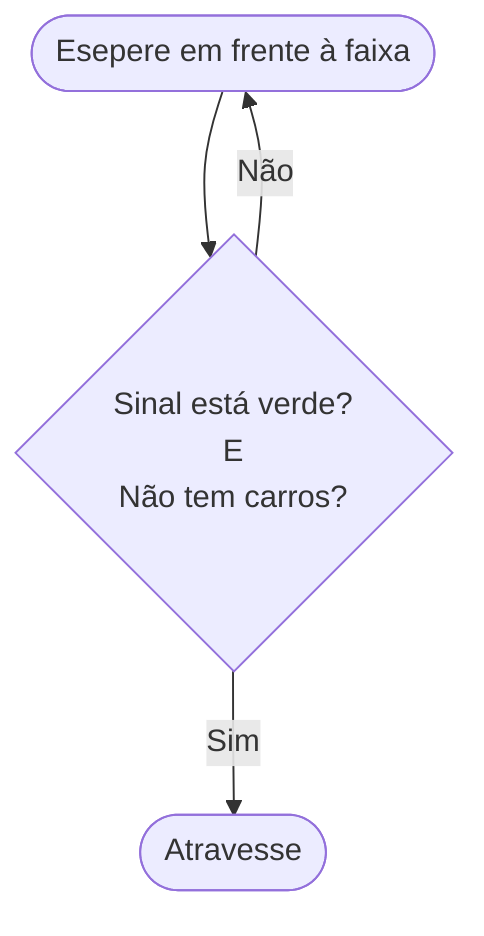
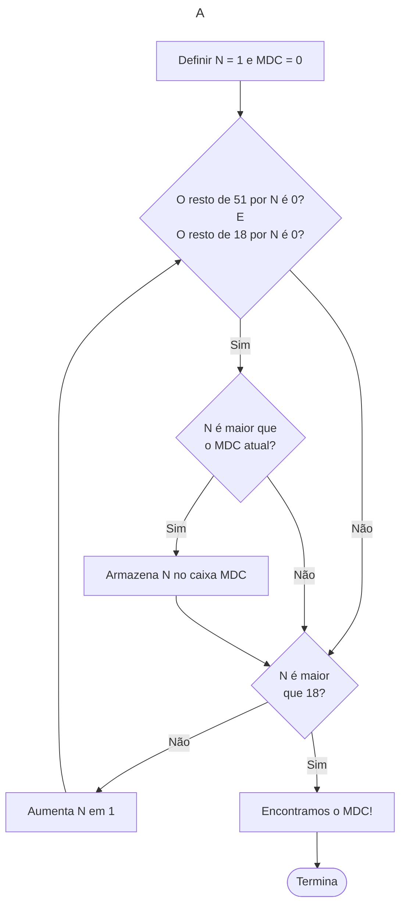

> "Contrariwise, if it was so, it might be; and if it were so, it would be; but as it isn't, it ain't. _That's logic._" - Tweedle Dee.

As estruturas de tomada de decisão são o que diferenciam o nosso computador de uma super-calculadora. São elas que dão a máquina uma inteligência aparente, digamos, artificial. Veremos nesse capítulo os _statements_ `if` e `else`! (Já estava ansioso por esse momento :D)

Porém, antes de começarmos, creio que podemos discutir um pouco sobre como estruturar um programa com condições. Na verdade esta é a parte mais importante do assunto, e onde muitos iniciantes em programação começam a ter algumas dificualdades. Em livros e aulas sobre programação a tendência comum é dar ênfase para a parte da escrita do código, mas a habilidade de _resolver problemas_ é grande alidada! E assim como outras skills, só se desenvolve com prática. 

Como quando vamos escrever um texto, não basta conhecer as palavras, mas é preciso também saber organizar as suas ideias. Ou quando vamos resolver uma questão de física, antes de fazer as contas, nós precisamos interpretar o problema e quebra-lo em pedaços menores. Tudo isso vale para a programação! 

# Rotinas e Lógica
Como você percebeu ao fazer os exercícios da última aula, fazer um programa é um exercício de pensar no problema antes de escrever qualquer código. O computador não entende o nosso pensamento, ele executa uma sequência de comandos que nós determinamos. Por isso, sempre que nos depararmos com um problema, precisamos pensar no passo-a-passo do que precisamos fazer para resolvê-lo. 

Essa sequencia de passos é uma **Rotina**. Vamos pensar na rotina de alguém que sai de casa para trabalhar ou ir para escola:

1. Tomar café da manhã
2. Tomar banho
3. **SE** estiver frio, vestir um casaco
4. Trancar a porta
5. Sair

Note que nessa rotina existe uma **decisão** a ser tomada. **Se** estiver frio, vestimos um casaco. Em outras palavras, a **condição** para vestir um casaco, é que esteja frio. Mas e se não estiver frio? Do modo que nós definimos esta rotina, nada sera feito, o próximo passo será dado. E quão frio é frio para usar casaco? Depende de cada um. Poderiamos ser mais específicos e dizer "Se estiver abaixo de 15 graus Celsius, vestir um casaco". 

> Eu levaria uma toalha ao sair de casa - Autor

Um exercício mental interessante para pensar uma rotina: Vamos pensar que você vai deixar uma receita de _algo_ para um robô burro. Por exemplo, vamos ensinar o rôbo a atravessar a rua. 

### Como atravessar a rua:

1. Espere em frente à faixa
2. Veja se o sinal de pedestre está verde
3. Olhe para os dois lado e veja se há carro
4. Atravesse

Veja como o nosso robo se saiu:

Ele executou o primeiro passo corretamente. Também executou o segunto passo corretamente. E então executou o terceiro e quarto passo. Ele foi atropelado seguindo todos os passos, pois não havia instruções claras do que seria feito com o resultado de cada passo. Antes de tomar a decisão de atravessar é preciso verificar o as condições dos outros passos são satisfeitas. 

Vamos repensar essa rotina, mas dessa vez de forma mais estruturada. 

### Como atravessar a rua v2.0:

1. Espere em frente à faixa
2. Veja se o sinal de pedestre está verde
    - Se sim, vá para o próximo
    - Se não, volte para o passo 1
3. Olhe para os dois lado e veja se há carro
    - Se sim, volte para o passo 2
    - Se não, vá para o próximo
4. Atravesse

Podemos representar essa rotina de uma forma mais visual:

>[info] Isso é um _fluxograma_, uma forma comum de apresentar _algoritimos_. Comumente representamos uma tomada de decisão com um losango. 

Para melhorar nossa rotina, podemos combinar as duas decisões em uma única. Isso porque o resultado das duas decisões é o mesmo no fim das contas, atrevessar a rua. 

Combinamos duas condições com o operador lógico **E**, e ao mesmo tempo, invertemos o resultado da segunda condição. Para poder atrvessar ao invés de verficar se "há carros" verificamos se **não** há carros. Acho que você já deve estar vendo como isso se relaciona com os operadores lógicos que vimos anteriormente.

Note que existe uma certe estrutura de repetição entre os passos 1 e 2. Sempre que a decisão tomada for negativa, o robo voltaria para o passo 1. De fato, podemos dizer que "**Enquanto** o sinal não estiver verde e não houver carros, o robô deve esperar em frente à faixa".

### Um algoritimo apra Maior Divisor Comum:

Vamos fazer mais uma rotina um pouco mais completa. Cálculo do Maior Divisor Comum entre dois inteiros, algo que aprendemos no jardim de infância. Talvez quando era criança você não entendia o porque isso funciona, mas ao seguir essa receita corretamente, você chegava no resultado (Você era um pequeno computador :3). 

O maior divisor comum é o maior número que divide dois inteiros, de forma que não haja resto. Por exemplo, o maior divisor comum entre 12 e 9 é 3. Agora olhe para o fluxograma que fizemos, e pense como você criaria uma rotina que encontra o MDC. 

Por exemplo, o MDC entre 51 e 18. Como podemos calcular isso? 

Podemos começar testando a partir do número 1, vamos chamar nosso divisor de N. Dividimos 51 por 1, e 18 por 1. Resto 0 para ambos. Então N = 1 é um divisor comum. Vamos guarda-lo na caixa `MDC`. 

Agora vamos tentar um número maior, 2. Dividimos 51 e 18 por 2. O resto de 51 divido por 2, é 1. O `MDC` continua sendo 1.

Agora vamos tentar um número maior, 3. Dividimos 51 e 18 por 3. O resto de 51 dividido por 3 é 0. E o resto de 18 dividido por 3 é 0. Logo 3 é um divisor comum. 3 é maior que 1, então vamos guardar 3 na caixa `MDC`. 

Para saber o resultado vamos repetir esse processo até que chegar em 18. Ai teremos certeza que encontramos o MDC (Nesse caso, o resultado seria 3). Ok, vamos tentar representar isso visualmente:

Preste atenção nesse fluxograma, conseguiu entender? Tome o tempo que precisar, não estamos com pressa :). Tente substituir os números por outros menores e mais simples para verificar como esse algoritmo funciona. Em breve, faremos ele no Python. 

A ideia aqui não é que você entenda completamente como construir um algoritimo completo para qualquer processo. Quero que você consinga visualizar como podemos quebrar um problema em etapas menores que se relacionam de forma lógica e sequencial. Esse tipo de abstração vai fazer bastante diferença no futuro, quando seus problemas se tornarem menos palpáveis. Bem, chega de teoria, vamos práticar. 

## Tomada de Decisão 

