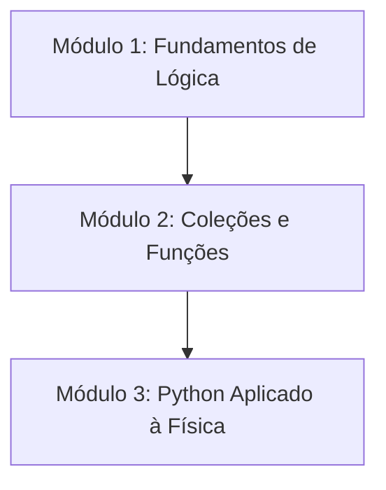

Me organizando para manter as coisas amarradas e didáticas

Tópicos ainda apresentados (nao sei onde encaixar):
- Formatação de String
- List Comprehension
- Como lidar com erros (try/except)

## Aula 1
- O que é Programação?
- Para que serve Python?
- Instalação do Python
- Abrindo o REPL
- Escrevendo nosso primeiro programa
- Comentários e boas práticas

## Aula 2
- Tipos em Python
    - Números (Inteiros e Floats)
    - Strings (Só apresentação, por enquanto)
    - Booleanos

## Aula 3
- O que é uma IDE
- Instalando VS Code
    - Extensão Python
    - Extensão Pylance
- Rodando um programa
- Usando input

## Aula 4
- Expressões
- Operadores Aritméticos
    - Ordem de prescedencia
- Operadores de Comparação
- Operadores Lógicos

## Aula 5
- Pensando em rotinas
    - Como quebro o problema?
    - Como organizo o código?
- Condicionais
    - if / else / elif
    - Nested Ifs

## Aula 6
- Loop while
- break e continue?

## Aula 7
- Tipos iteráveis
    - String
    - Lista
- Slicing
- Métodos de listas (nao falei nada de método ainda...)

## Aula 8
- Loop For
- Listas

## Aula 9
- Funções
- Escopo

## Aula ?
- Tuplas
- Dicionários
- Sets?

## Aula depois da 9
- Recursividade?

## Aula 
- Imports
- Ambiente Virtual
    - O que é?
    - Por que usar?

## Aula 
- Trabalhando problemas
    - Aplicar os conceitos
- Criando um projeto?

## Aula
